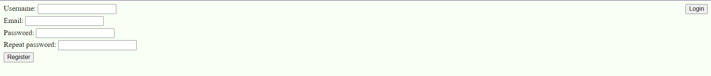
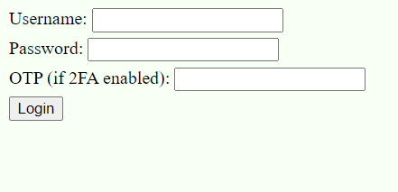
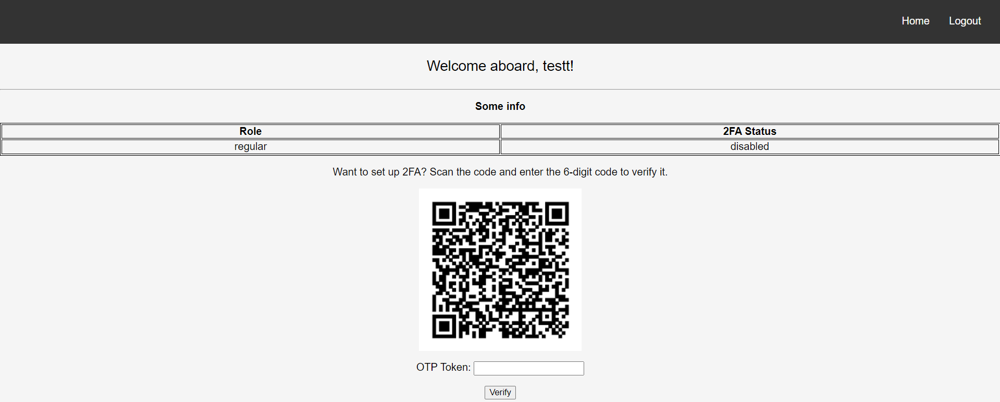

# Information security - 2023/2024/Z - homework 2

## Information security in a web application

For the purpose of this homework, I've made a simple PHP web application that uses a **postgres** database for storage.  

### Authentication

#### User registration
At the `/register.php` route, the user is presented the following screen:

The page contains a `form` in which the user provides the following information:
  - username
  - email
  - password
  - repeat password

The `username` and `email` are **unique** in the database, which means there cannot be 2 users with either the same 
`username` or `email`.

The `password` is not stored as plain text, first it's hashed with the `password_hash()` function using the 
current default PHP default hashing algorithm *bcrypt*.

Each form parameter provided from the user is sanitized for SQL use with the `pg_escape_string()` function.

In addition to the previous method of sanitizing user input, the SQL query is executed as a *prepared* statement 
using the `pg_prepare()` function which further improves security and performance.

 

#### User login/logout
At the `/login.php` route, the following screen is shown:

The login form requires the user to input the `username` and `password` fields.

After the user submits the form, the input is sanitized with the `pg_escape_string()` function. The SQL query is 
executed as a prepared statement.

If a user with the provided `username` is found, the `password` provided by the user is hashed and compared to the 
hash of the user from the database. If they match, a *session variable* is set that indicates that the current session 
has a specific user logged in.

After the user successfully logs in, he is redirected to the `index.php` page:

Clicking the `logout` button destroys the session and clears the `$_SESSION` array. 

 

#### Managing login information
As mentioned previously the following measures are taken when managing user information:
- sanitize user form input
- use prepared SQL statements
- store the hash of the password instead of the plain text

 

#### Cross-site Request Forgery
To further improve the level of integrity, I've added a CSRF attack prevention measure.
This means that forms on the site can be submitted by the user only and not third-party web applications.

When the user visits the register or login pages, a session variable containing a randomly generated token is created.
In every form that the user submits, a *hidden* input field containing the session token is included.

After the user submits a form, before anything, the session token is compared to the token sent by the user making the 
request. If they match, this tells us that the user indeed, made the request himself. If they do not match, a 
`405 Method Not Allowed` response is returned. 